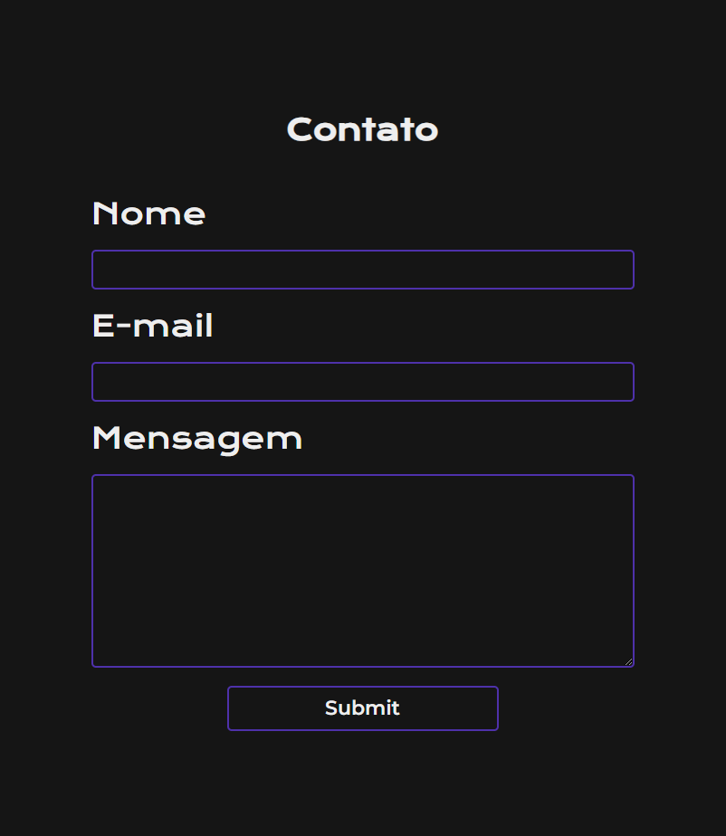

# ⚡ Formulário de Contato

## Utilização 

Para criarmos nosso formulário precisamos acessar o site: https://www.staticforms.xyz/ 

Nesse site devemos cadastrar nosso e-mail para poder pegar a chave de acesso, que nos possibilita receber e-mails.

Feito isso podemos pegar esse exemplo de código disponibilizado pela problema ferramenta e inserir no corpo do html.

Porem vamos fazer algumas alterações e entender o que está acontecendo em cada tag.

```html
    <form action="https://api.staticforms.xyz/submit" method="post">
            <!-- Tags de configuração -->
            <input type="text" name="honeypot" style="display:none"><!-- Tag responsavel por proteger contra spam -->
            <input type="hidden" name="accessKey" value="aaaaaaaa-bbbb-cccc-dddd-eeee6666kkkk"><!-- Tag onde se colocar a chave de acesso -->
            <input type="hidden" name="redirectTo" value="https://example.com/contact/success"><!-- Tag de redireonamento de página -->
            <!-- Tags que aparecem no formulário -->
            <label>Nome</label>
            <input type="text" name="name" required/>
            <label>E-mail</label>
            <input type="text" name="email" required/>
            <label>Mensagem</label>
            <textarea name="message"></textarea>            
            <input type="submit" value="Submit" />
    </form>
```

Aqui já temos a página web básica:

```html
<!DOCTYPE html>
<html lang="pt-br">
<head>
    <meta charset="UTF-8">
    <meta name="viewport" content="width=device-width, initial-scale=1.0">
    <link rel="stylesheet" href="style.css">
    <title>Fomulário de Contato</title>
</head>
<body>
    <main>
        <h1>Contato</h1>
        <form action="https://api.staticforms.xyz/submit" method="post">
            <!-- Tags de configuração -->
            <input type="text" name="honeypot" style="display:none"><!-- Tag responsavel por proteger contra spam -->
            <input type="hidden" name="accessKey" value="aaaaaaaa-bbbb-cccc-dddd-eeee6666kkkk"><!-- Tag onde se colocar a chave de acesso -->
            <input type="hidden" name="redirectTo" value="http://127.0.0.1:5500/obrigado.html"><!-- Tag de redireonamento de página -->
            <!-- Tags que aparecem no formulário -->
            <label>Nome</label>
            <input type="text" name="name" required class="entradas"/>
            <label>E-mail</label>
            <input type="text" name="email" required class="entradas"/>
            <label>Mensagem</label>
            <textarea name="message"></textarea>
            <div>
                <input type="submit" value="Submit"/>
            </div>            
        </form>
    </main>
</body>
</html>
```

Lembre-se que na tag `<input type="hidden" name="redirectTo" value="http://127.0.0.1:5500/obrigado.html">` você deve passar como valor o local da página, nesse caso estou usando o live server e a url para acessar o arquivo `obrigado.html` fica dessa maneira `http://127.0.0.1:5500/obrigado.html` .

O arquivo de obrigado vai ter o seguinte código:

```html
<!DOCTYPE html>
<html lang="pt-br">
<head>
    <meta charset="UTF-8">
    <meta name="viewport" content="width=device-width, initial-scale=1.0">
    <link rel="stylesheet" href="style.css">
    <title>Fomulário de Contato</title>
</head>
<body>
    <main class="conteudo">
        <h1 class>Obrigado!</h1>
        <p class>Seu e-mail foi enviado com sucesso, assim que possível damos um retorno, fique avontade para enviar novamente caso tenha mais alguma dúvida.</p>
        <a href="http://127.0.0.1:5500/index.html">Voltar</a>
    </main>
</body>
</html>
```

Nada muito complexo apenas texto e um link para voltar a página anterior. O nosso `style.css`  ficou da seguinte maneira:

```css
@import url('https://fonts.googleapis.com/css2?family=Krona+One&family=Montserrat:wght@400;600&display=swap');

:root {
    --cor-primaria: #151515;
    --cor-secundaria: #EEEEEE;
    --cor-terciaria: #4E31AA;

    --fonte-primaria: 'Krona One', sans-serif;
    --fonte-secundaria: 'Montserrat', sans-serif;
}

body{
    background: var(--cor-primaria);
    height: 100vh;
    display: flex;
    flex-direction: column;
    justify-content: center;
    align-items: center;
}

main{
    display: flex;
    flex-direction: column;
    align-items: center;
    gap: 32px;
}

h1{
    font-family: var(--fonte-primaria);
    font-size: 32px;
    color: var(--cor-secundaria);
}

form{
    display: flex;
    flex-direction: column;
    width: 600px;
    gap: 20px;
}

label{
    font-family: var(--fonte-primaria);
    font-size: 32px;
    color: var(--cor-secundaria);
}

input{
    font-family: var(--fonte-secundaria);
    font-weight: 400;
    font-size: 16px;
    height: 30px;
    padding: 5px;
    border-radius: 5px;
    outline: none;
    border: 2px solid var(--cor-terciaria);
    background: var(--cor-primaria);
    color: var(--cor-secundaria);
}

textarea{
    font-family: var(--fonte-secundaria);
    font-weight: 400;
    font-size: 18px;
    height: 200px;
    padding: 5px;
    border-radius: 5px;
    resize: vertical;
    outline: none;
    border: 2px solid var(--cor-terciaria);
    background: var(--cor-primaria);
    color: var(--cor-secundaria);
}

div{
    display: flex;
    justify-content: center;
}

div input{
    font-family: var(--fonte-secundaria);
    font-weight: 700;
    font-size: 22px;
    padding: 5px;
    width: 50%;
    height: 50px;
    cursor: pointer;
}

div input:hover{
    background: var(--cor-terciaria);
}

.conteudo{
    display: block;
    padding: 45px;
    width: 40%;
    background: var(--cor-terciaria);
    border-radius: 30px;
    box-shadow: #2b2a2a 10px 12px;
}

p{
    font-family: var(--fonte-secundaria);
    font-weight: 400;
    font-size: 22px;
    color: var(--cor-secundaria);
}

a{
    font-family: var(--fonte-secundaria);
    font-weight: 600;
    font-size: 22px;
    color: var(--cor-secundaria);
    padding: 5px;
}

@media (max-width: 700px){
    form{
        width: 300px;
        gap: 15px;
    }
    input{
        height: 15px;
    }
    label{
        font-size: 25px;
    }
    div input{
        width: 35%;
        font-size: 18px;
    }
}
```

No final temos uma página de contato personalizada e responsiva.



---

# Desenvolvimento do Formulário

Durante a criação deste formulário, desenvolvi habilidades essenciais em desenvolvimento web front-end, incluindo:

- 📝 Estruturação de Conteúdo: Organizei o conteúdo do formulário utilizando as melhores práticas de HTML, garantindo uma estrutura semântica que melhora a acessibilidade e a usabilidade do site.

- 💜 Estilo e Design Responsivo: Com CSS, estilizei o formulário para ser visualmente atraente e funcional em diferentes dispositivos, usando técnicas como flexbox e media queries.

- 💥 UX/UI: Foquei na experiência do usuário (UX) ao projetar um layout intuitivo, com campos de entrada claros, botões de ação destacados, amigáveis para orientar o usuário.

- 🌀 Validação de Formulário: Implementei estilos para realçar os campos obrigatórios, melhorando a interatividade e a eficiência do formulário.

- 🐦 Compatibilidade entre Navegadores: Testei e ajustei o formulário para garantir que ele funcione corretamente em diferentes navegadores e sistemas operacionais, mantendo a consistência visual e funcional.

